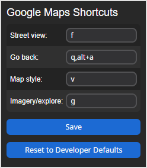

## Google Maps Shortcuts

Create custom keyboard shortcuts for Google Maps. Shortcuts can be customized from the pop up. You can define multiple keys separated by commas (e.g. `f, t, y`), and use control, shift, and alt keys as modifiers by appending them to a key with '+' (e.g. `alt + a`, `ctrl + shift + s`). The defaults are as follows.

| Key          | Function                      |
|--------------|-------------------------------|
|  F           | Toggle street view            |
|  Q, Alt + A  | Go back (exit menus etc.)     |
|  V           | Switch satellite/default view |
|  G           | Toggle imagery/explore        |

### Installation

* [Chrome Web Store](https://chromewebstore.google.com/detail/cjhlnpanejjhebgiajjmbnhdfdppogmh)
* [Firefox Add-ons](https://addons.mozilla.org/en-US/firefox/addon/google_maps_shortcuts/)

### Popup Screenshot

### Known issues

* Search shortcut does not work
* In some cases the Imagery/Explore bar doesn't display anything until the map is dragged or zoomed

### License

GNU General Public License version 3 or later.